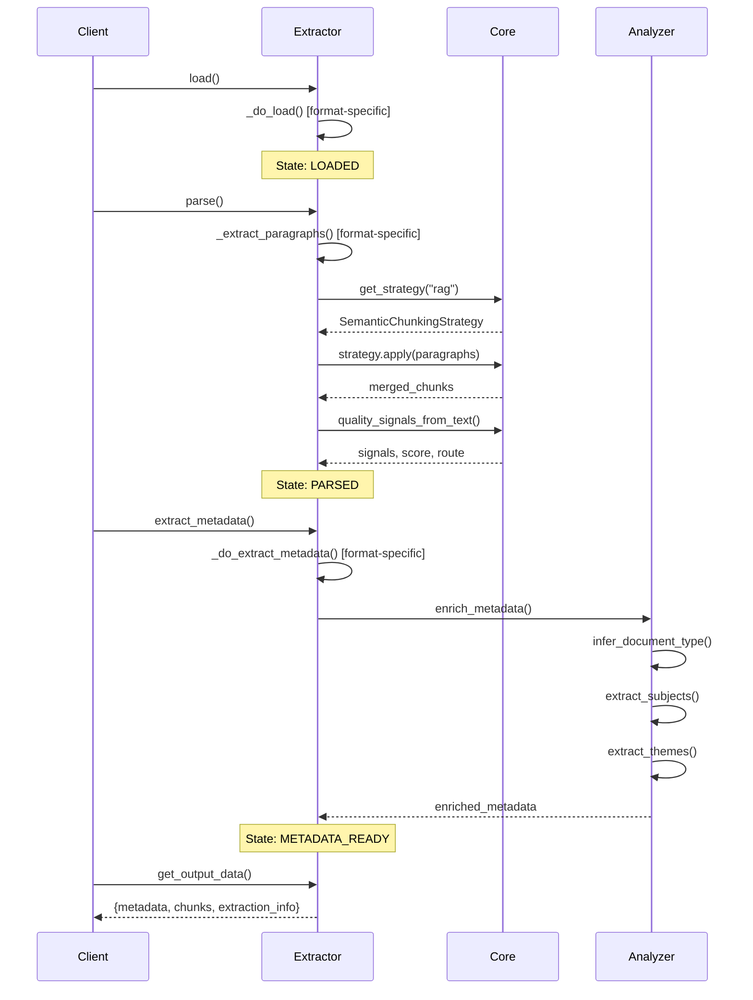

# Architecture

**Understanding the three-layer design of the extraction library**

The extraction library is built on a three-layer architecture that separates concerns into distinct, testable components. This design enables format-agnostic extraction, domain-specific enrichment, and consistent output across all document types.

## Overview

The library processes documents through three sequential layers:

```
┌──────────────────────────────────────────────────────┐
│                   Layer 3: Analyzers                 │
│         Domain-specific metadata enrichment          │
│   (CatholicAnalyzer, GenericAnalyzer, custom...)     │
└──────────────────────────────────────────────────────┘
                           ↑
                           │ Chunk[] + Metadata
                           │
┌──────────────────────────────────────────────────────┐
│                   Layer 2: Extractors                │
│          Format-specific parsing & chunking          │
│     (EpubExtractor, PdfExtractor, HtmlExtractor...)  │
└──────────────────────────────────────────────────────┘
                           ↑
                           │ Raw documents
                           │
┌──────────────────────────────────────────────────────┐
│                 Layer 1: Core Utilities              │
│     Format-agnostic text processing & models         │
│   (chunking, quality, extraction, models, text...)   │
└──────────────────────────────────────────────────────┘
```

Each layer has a clear responsibility:

1. **Core Utilities**: Shared algorithms and data models
2. **Extractors**: Format-specific parsing into uniform chunks
3. **Analyzers**: Domain-specific metadata enrichment

This separation enables you to:

- Add new document formats without changing core algorithms
- Add new domain analyzers without changing extractors
- Test each layer independently
- Reuse core utilities across all formats

## Layer 1: Core Utilities

**Location**: `src/extraction/core/`

The core layer provides format-agnostic utilities used by all extractors. These modules contain no format-specific logic - they operate on text, chunks, and metadata regardless of source.

### Key Modules

**models.py** - Type-safe data models

Defines the contract that all extractors must fulfill:

```python
@dataclass
class Chunk:
    """A single text chunk from a document."""
    stable_id: str
    paragraph_id: int
    text: str
    hierarchy: Dict[str, str]
    word_count: int
    scripture_references: List[str]
    cross_references: List[str]
    # ... 18+ fields total
```

Every extractor produces `Chunk` objects with these exact fields. This ensures consistent output regardless of input format.

Other models:

- `Metadata`: Document-level metadata
- `Provenance`: Source file and processing metadata
- `Quality`: Quality signals and routing
- `Hierarchy`: 6-level heading structure

**chunking.py** - Sentence and hierarchy utilities

```python
def split_sentences(text: str) -> List[str]:
    """Split text into sentences on punctuation boundaries."""

def heading_path(hierarchy: Dict[str, str]) -> str:
    """Join hierarchy levels into path: 'Book / Chapter 1 / Section A'"""

def hierarchy_depth(hierarchy: Dict[str, str]) -> int:
    """Return deepest non-empty level (1-6)."""
```

These functions maintain the 6-level heading hierarchy that flows through documents.

**strategies.py** - Chunking strategies

Implements the RAG vs NLP chunking algorithms (see [Chunking Strategies](chunking-strategies.md) for details):

```python
class SemanticChunkingStrategy(ChunkingStrategy):
    """RAG/embeddings mode: Merge paragraphs into 100-500 word chunks."""

class ParagraphChunkingStrategy(ChunkingStrategy):
    """NLP mode: Preserve paragraph boundaries."""
```

Strategies are pluggable - extractors apply them to raw paragraphs after parsing.

**quality.py** - Quality scoring

```python
def quality_signals_from_text(
    full_text: str,
    chunks: List[Dict[str, Any]]
) -> Dict[str, float]:
    """
    Compute quality signals:
    - avg_para_len: Average paragraph length
    - heading_density: Headings per paragraph ratio
    - vocabulary_richness: Unique words / total words
    - scripture_density: Scripture refs per 1000 words
    - cross_ref_density: Cross-refs per 1000 words
    """

def score_quality(signals: Dict[str, float]) -> float:
    """Weight and combine signals into 0-1 score."""

def route_doc(score: float) -> str:
    """Route to A (≥0.7), B (0.4-0.7), or C (<0.4)."""
```

Quality scoring helps prioritize review effort on low-quality documents.

**extraction.py** - Reference extraction

```python
def extract_scripture_references(text: str) -> List[str]:
    """Find Bible references: 'John 3:16', 'Matthew 5:1-12'"""

def extract_cross_references(text: str) -> List[str]:
    """Find internal links: 'See Chapter 7', 'Section 3.2'"""

def extract_dates(text: str) -> List[str]:
    """Find date mentions for temporal context."""
```

These extractors use regex patterns to identify structured references in text.

**noise_filter.py** - Noise detection (v2.4+)

```python
class NoiseFilter:
    """
    Detect chunks with zero semantic value:
    - Index pages (number/punctuation heavy)
    - Copyright boilerplate
    - Navigation fragments
    """

    def is_noise(self, chunk: Dict[str, Any]) -> bool:
        """Check if chunk should be filtered."""
```

Filters ~3-5% of chunks that add no value for embeddings.

### Why This Layer Matters

Core utilities ensure **consistency across formats**. When you extract an EPUB and a PDF, both use the same:

- Quality scoring algorithm
- Reference extraction patterns
- Chunking strategy
- Hierarchy tracking

This means your downstream pipeline (embedding, vector DB, search) sees uniform data regardless of source format.

## Layer 2: Extractors

**Location**: `src/extraction/extractors/`

Extractors handle format-specific parsing. Each extractor inherits from `BaseExtractor` and implements three methods:

```python
class BaseExtractor(ABC):
    """Abstract base for all extractors."""

    @abstractmethod
    def _do_load(self) -> None:
        """Load the source document."""

    @abstractmethod
    def _do_parse(self) -> None:
        """Extract chunks and populate self._raw_chunks."""

    @abstractmethod
    def _do_extract_metadata(self) -> Metadata:
        """Extract document-level metadata."""
```

### Extractor Lifecycle (State Machine)

Extractors follow a strict state machine to ensure correct method ordering:

```
CREATED
   ↓ load()
LOADED
   ↓ parse()
PARSED
   ↓ extract_metadata()
METADATA_READY
   ↓ get_output_data()
OUTPUT_READY
```

Each state transition is validated:

```python
def load(self) -> None:
    self._require_state("load", [ExtractorState.CREATED])
    self._do_load()
    self._state = ExtractorState.LOADED
```

If you call methods out of order, you get a `MethodOrderError`:

```python
extractor = EpubExtractor("book.epub")
extractor.parse()  # ❌ MethodOrderError: parse() requires LOADED, got CREATED
```

This prevents common bugs like accessing chunks before parsing.

### Format-Specific Implementations

**EpubExtractor** - EPUB documents

Handles EPUB's unique challenges:

- **Spine traversal**: EPUBs are collections of XHTML documents
- **TOC integration**: Table of contents can populate hierarchy levels
- **Hierarchy preservation**: Option to preserve or reset hierarchy across spine docs

```python
class EpubExtractor(BaseExtractor):
    def _do_load(self) -> None:
        """Open EPUB, read spine, parse TOC."""
        self.epub = epub.read_epub(self.source_path)
        self.spine_docs = self._get_spine_documents()
        self.toc_hierarchy = self._parse_toc()

    def _do_parse(self) -> None:
        """Iterate spine, extract paragraphs, apply chunking strategy."""
        for spine_doc in self.spine_docs:
            paragraphs = self._extract_paragraphs(spine_doc)
            self._raw_chunks.extend(paragraphs)

        # Apply chunking strategy (RAG or NLP)
        strategy = get_strategy(self.config.chunking_strategy)
        final_chunks = strategy.apply(self._raw_chunks, chunk_config)
```

**PdfExtractor** - PDF documents

Challenges:

- **Layout analysis**: Text may not be in reading order
- **Heading detection**: Uses font size threshold to identify headings
- **OCR support**: Optional for scanned PDFs

```python
class PdfExtractor(BaseExtractor):
    def _do_parse(self) -> None:
        """Extract text with layout analysis."""
        for page in self.pdf.pages:
            # Sort text boxes by Y-position (top to bottom)
            text_boxes = self._extract_text_boxes(page)

            for box in text_boxes:
                if self._is_heading(box.font_size):
                    self._update_hierarchy(box.text)
                else:
                    self._add_paragraph(box.text)
```

**HtmlExtractor** - HTML documents

Simple structure:

- Parse with BeautifulSoup
- Identify headings (h1-h6)
- Extract paragraphs (p, div)
- Apply formatting preservation if enabled

**MarkdownExtractor** - Markdown files

- Parse frontmatter (YAML)
- Convert to HTML with markdown library
- Extract like HTML

**JsonExtractor** - Pre-extracted JSON

For documents already extracted by legacy parsers:

- Load existing chunks
- Validate schema
- Apply chunking strategy if needed

### Chunking Strategy Application

All extractors follow the same pattern:

1. **Extract paragraphs**: Format-specific parsing produces raw paragraph chunks
2. **Apply strategy**: Use `SemanticChunkingStrategy` (RAG) or `ParagraphChunkingStrategy` (NLP)
3. **Filter noise**: Remove index pages, copyright, navigation
4. **Filter tiny chunks**: Remove <5 word fragments (conservative mode)

```python
def _do_parse(self) -> None:
    # Step 1: Extract paragraphs (format-specific)
    self._raw_chunks = self._extract_paragraphs()

    # Step 2: Apply chunking strategy
    strategy = get_strategy(self.config.chunking_strategy)
    config = ChunkConfig(
        min_words=self.config.min_chunk_words,
        max_words=self.config.max_chunk_words,
    )
    merged_chunks = strategy.apply(self._raw_chunks, config)

    # Step 3: Filter noise
    if self.config.filter_noise:
        merged_chunks = [c for c in merged_chunks if not is_noise(c)]

    # Step 4: Convert to Chunk objects
    self._chunks = [Chunk(**c) for c in merged_chunks]
```

This consistency means chunking behavior is identical across all formats.

## Layer 3: Analyzers

**Location**: `src/extraction/analyzers/`

Analyzers enrich metadata with domain-specific information. They operate on the output of extractors - the full text and chunks.

### Analyzer Interface

```python
class BaseAnalyzer(ABC):
    """Abstract base for domain analyzers."""

    @abstractmethod
    def infer_document_type(self, text: str) -> str:
        """Classify document type."""

    @abstractmethod
    def extract_subjects(self, text: str, chunks: List[Dict]) -> List[str]:
        """Extract subject keywords."""

    @abstractmethod
    def extract_themes(self, chunks: List[Dict]) -> List[str]:
        """Extract recurring themes."""

    @abstractmethod
    def extract_related_documents(self, text: str, chunks: List[Dict]) -> List[str]:
        """Find document references."""

    @abstractmethod
    def infer_geographic_focus(self, text: str) -> str:
        """Identify geographic focus."""

    def enrich_metadata(
        self,
        metadata_dict: Dict,
        full_text: str,
        chunks: List[Dict]
    ) -> Dict:
        """
        Orchestrate all enrichment methods.
        Returns metadata_dict with added fields.
        """
```

### Built-in Analyzers

**GenericAnalyzer** - Default analyzer

Minimal implementation:

```python
class GenericAnalyzer(BaseAnalyzer):
    def infer_document_type(self, text: str) -> str:
        return "Document"

    def extract_subjects(self, text: str, chunks: List[Dict]) -> List[str]:
        return []  # No subject extraction

    # ... other methods return empty/default values
```

Used when no domain-specific analysis is needed.

**CatholicAnalyzer** - Catholic literature

Domain-specific patterns:

```python
class CatholicAnalyzer(BaseAnalyzer):
    ENCYCLICAL_PATTERNS = [
        r'\bencyclical\b',
        r'\bpope\s+\w+\s+(xvi|xiii|xiv|xv)',
        # ...
    ]

    SUBJECT_PATTERNS = {
        "Liturgy": [r'\bliturgy\b', r'\bmass\b', r'\bsacrament\b'],
        "Christology": [r'\bchrist\b', r'\bincarnation\b'],
        # ... 20+ subject areas
    }

    def infer_document_type(self, text: str) -> str:
        """Detect Encyclical, Catechism, Prayer, etc."""
        if any(re.search(p, text, re.I) for p in self.ENCYCLICAL_PATTERNS):
            return "Encyclical"
        # ... other document types
        return "Catholic Document"

    def extract_subjects(self, text: str, chunks: List[Dict]) -> List[str]:
        """Match against SUBJECT_PATTERNS."""
        subjects = []
        for subject, patterns in self.SUBJECT_PATTERNS.items():
            if any(re.search(p, text, re.I) for p in patterns):
                subjects.append(subject)
        return subjects
```

This adds rich metadata for Catholic documents:

- `document_type`: "Encyclical", "Catechism", "Council Document"
- `subjects`: ["Liturgy", "Sacraments", "Christology"]
- `themes`: Extracted from chapter/section headings
- `related_documents`: Detected citations of other documents

### Creating Custom Analyzers

For other domains (legal, medical, academic), implement `BaseAnalyzer`:

```python
class LegalAnalyzer(BaseAnalyzer):
    CASE_PATTERNS = [r'\bv\.\s+\w+', r'\d+\s+U\.S\.']
    SUBJECT_PATTERNS = {
        "Contract Law": [r'\bcontract\b', r'\bagreement\b'],
        "Tort": [r'\bnegligence\b', r'\bliability\b'],
    }

    def infer_document_type(self, text: str) -> str:
        if any(re.search(p, text) for p in self.CASE_PATTERNS):
            return "Case Law"
        return "Legal Document"

    # ... implement other methods
```

Then use it:

```python
from extraction.extractors import PdfExtractor
from mypackage.analyzers import LegalAnalyzer

extractor = PdfExtractor("case.pdf", analyzer=LegalAnalyzer())
extractor.load()
extractor.parse()
metadata = extractor.extract_metadata()

# Now includes legal-specific fields
print(metadata.document_type)  # "Case Law"
print(metadata.subjects)       # ["Contract Law", "Tort"]
```

## Data Flow

Here's how a document flows through the three layers:



Step-by-step:

1. **load()**: Extractor opens file, reads structure (EPUB spine, PDF pages, etc.)
2. **parse()**:
   - Extractor extracts paragraphs (format-specific)
   - Core applies chunking strategy (format-agnostic)
   - Core computes quality signals
   - Extractor creates Chunk objects
3. **extract_metadata()**:
   - Extractor extracts base metadata (title, author, etc.)
   - Analyzer enriches with domain fields
   - Returns complete Metadata object
4. **get_output_data()**: Serialize to JSON

## Design Decisions

### Why Three Layers?

**Alternative**: Monolithic extractor per format

Each format has its own chunking, quality, and analysis logic. Problems:

- Code duplication across formats
- Inconsistent output (EPUB chunks differ from PDF chunks)
- Hard to add new strategies or analyzers

**Our approach**: Separate concerns

- Core utilities shared = consistent behavior
- Extractors focus on parsing = easier to add formats
- Analyzers pluggable = domain extensibility

### Why State Machine?

**Alternative**: No state tracking

Allow methods to be called in any order. Problems:

- Calling `parse()` before `load()` causes confusing errors
- Accessing `chunks` before `parse()` returns empty list (hard to debug)
- No clear lifecycle

**Our approach**: Explicit state transitions

- Clear error messages ("parse() requires LOADED state")
- Prevents common bugs
- Documents the expected workflow

### Why Dataclasses for Models?

**Alternative**: Plain dictionaries

Pass around `Dict[str, Any]` everywhere. Problems:

- No type safety
- No IDE autocomplete
- Easy to misspell field names
- Hard to know what fields exist

**Our approach**: Type-safe dataclasses with `to_dict()` methods

- Type checking catches errors early
- IDE autocomplete works
- Still outputs dictionaries for backward compatibility
- Clear contract for what fields exist

### Why Pluggable Strategies?

**Alternative**: Hardcoded chunking in each extractor

Each extractor implements its own RAG/NLP chunking. Problems:

- Behavior differs across formats
- Adding a new strategy requires changing all extractors
- Testing requires format-specific test cases

**Our approach**: Strategy pattern

- One implementation of RAG chunking works for all formats
- Adding a new strategy is one new class
- Can test strategies independently of extractors

## Chunk Lifecycle

Understanding how a paragraph becomes a final chunk:

```
Raw Text (HTML, PDF, EPUB)
         ↓
    Paragraph Extraction (format-specific)
         ↓
    Raw Paragraph Chunk (dict with text, hierarchy, references)
         ↓
    Chunking Strategy Application
         ↓
    ┌─────────────┴─────────────┐
    ↓                           ↓
RAG: Semantic Merging      NLP: No Change
(100-500 words)            (paragraph-level)
    ↓                           ↓
    └─────────────┬─────────────┘
         ↓
    Noise Filtering (optional)
         ↓
    Tiny Chunk Filtering (optional)
         ↓
    Chunk Object Creation
         ↓
    Final Chunk (Chunk dataclass)
```

**Stage 1: Paragraph Extraction**

Format-specific parsing extracts text into paragraphs:

```python
{
    "text": "This is a paragraph.",
    "hierarchy": {"level_1": "Chapter 1"},
    "word_count": 4,
    "paragraph_id": 1,
    # ... other fields
}
```

**Stage 2: Strategy Application**

RAG mode merges paragraphs:

```python
# Before (3 paragraphs under same heading)
[
    {"text": "Para 1", "word_count": 50, "hierarchy": {"level_1": "Ch1"}},
    {"text": "Para 2", "word_count": 60, "hierarchy": {"level_1": "Ch1"}},
    {"text": "Para 3", "word_count": 70, "hierarchy": {"level_1": "Ch1"}},
]

# After (1 merged chunk)
[
    {
        "text": "Para 1\n\nPara 2\n\nPara 3",
        "word_count": 180,
        "hierarchy": {"level_1": "Ch1"},
        "merged_paragraph_ids": [1, 2, 3],
        "source_paragraph_count": 3,
    }
]
```

NLP mode keeps them separate.

**Stage 3: Filtering**

- **Noise filter**: Remove index pages, copyright, navigation
- **Tiny chunk filter**: Remove <5 word fragments

**Stage 4: Object Creation**

Convert dicts to `Chunk` dataclass instances for type safety.

## Extending the Architecture

### Adding a New Extractor

1. **Create `src/extraction/extractors/myformat.py`**:

```python
from .base import BaseExtractor
from ..core.models import Metadata

class MyFormatExtractor(BaseExtractor):
    def _do_load(self) -> None:
        """Load the file."""
        self.data = load_file(self.source_path)

    def _do_parse(self) -> None:
        """Extract paragraphs."""
        self._raw_chunks = extract_paragraphs(self.data)

        # Apply chunking strategy
        strategy = get_strategy(self.config.chunking_strategy)
        final_chunks = strategy.apply(self._raw_chunks, chunk_config)
        self._chunks = [Chunk(**c) for c in final_chunks]

    def _do_extract_metadata(self) -> Metadata:
        """Extract metadata."""
        return Metadata(
            title=self.data.get("title", ""),
            author=self.data.get("author", ""),
        )
```

2. **Register in `src/extraction/extractors/__init__.py`**:

```python
from .myformat import MyFormatExtractor

__all__ = [..., "MyFormatExtractor"]
```

3. **Add format detection in CLI**:

```python
def detect_format(path: str) -> str:
    if path.endswith(".myformat"):
        return "myformat"
    # ...
```

4. **Add tests**:

```python
def test_myformat_extractor_interface():
    """Verify MyFormatExtractor implements BaseExtractor interface."""
    extractor = MyFormatExtractor("test.myformat")
    assert hasattr(extractor, "load")
    assert hasattr(extractor, "parse")
    # ...
```

### Adding a New Analyzer

See [Creating Custom Analyzers](../how-to/custom-analyzers.md) for a detailed guide.

### Adding a New Chunking Strategy

1. **Create strategy class**:

```python
class SentenceChunkingStrategy(ChunkingStrategy):
    """One sentence per chunk."""

    def apply(self, chunks: List[Dict], config: ChunkConfig) -> List[Dict]:
        sentence_chunks = []
        for chunk in chunks:
            sentences = split_sentences(chunk["text"])
            for sent in sentences:
                sentence_chunks.append({
                    "text": sent,
                    "word_count": len(sent.split()),
                    # ... other fields
                })
        return sentence_chunks

    def name(self) -> str:
        return "sentence"
```

2. **Register in `STRATEGIES` dict**:

```python
STRATEGIES = {
    # ... existing strategies
    "sentence": SentenceChunkingStrategy(),
}
```

3. **Use it**:

```bash
extract book.epub --chunking-strategy sentence
```

## Summary

The three-layer architecture provides:

1. **Consistency**: All formats produce identical output
2. **Extensibility**: Add formats, analyzers, strategies independently
3. **Testability**: Test each layer in isolation
4. **Clarity**: Clear separation of concerns

When you use the library, you're leveraging:

- **Core utilities** that ensure consistent chunking and quality scoring
- **Format extractors** that handle EPUB/PDF/HTML/Markdown/JSON specifics
- **Domain analyzers** that add metadata relevant to your use case

This design makes the library both powerful (supports many formats) and flexible (extend for your domain).
