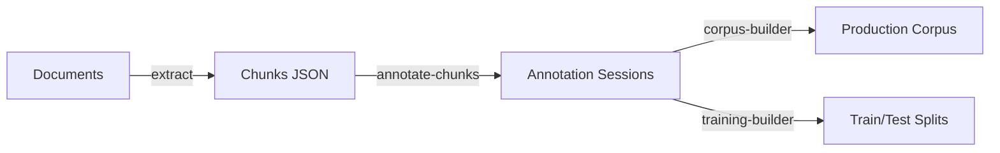

# Annotation Workflow

End-to-end guide for building high-quality training datasets from extraction outputs using the annotation, corpus, and training tools.

## Overview

The workflow has four stages:

1. **Extract** --- Process documents into chunks
2. **Annotate** --- Label chunk quality interactively
3. **Build Corpus** --- Aggregate good chunks into JSONL
4. **Build Training Data** --- Create ML-ready train/test splits



## Step 1: Extract Documents

Process your documents into chunks. RAG chunking (the default) is recommended for embedding and retrieval use cases.

```bash
# Batch extract all documents
extract documents/ -r --output-dir extractions/

# Single document
extract book.epub --output extractions/book.json
```

For NLP tasks that need paragraph-level granularity, use `--chunking-strategy nlp`. See [Choosing a Chunking Strategy](chunking-strategy.md) for details.

!!! tip "Extract all documents before annotating"
    Use consistent chunking parameters across all documents. Extract everything first, then annotate --- this avoids parameter drift between batches.

## Step 2: Annotate Chunks

Launch the annotation TUI for each extraction output:

```bash
annotate-chunks extractions/book.json
```

### Key Controls

| Key | Action |
|-----|--------|
| `j` / `k` | Navigate to next / previous chunk |
| `g` | Label chunk as **good** |
| `b` | Label chunk as **bad** |
| `s` | **Skip** chunk (unlabeled) |
| `i` | Toggle **issue** flags on current chunk |
| `e` | **Edit** chunk text (edits carry through to corpus) |
| `u` | Undo last action |
| `?` | Help overlay |
| `q` | Quit (auto-saves) |

Sessions auto-save every 10 annotations to `.annotation_sessions/`. To resume a previous session:

```bash
annotate-chunks extractions/book.json --resume
```

### Export Annotations

Export labeled data directly without opening the TUI:

```bash
# All annotations as JSONL
annotate-chunks extractions/book.json --export-only

# Train/test split
annotate-chunks extractions/book.json --export-only --export-type split

# Grouped by label
annotate-chunks extractions/book.json --export-only --export-type labels

# View statistics
annotate-chunks extractions/book.json --stats-only
```

### Annotation Tips

- **Start small**: Annotate 20--30 chunks to calibrate your good/bad criteria before committing to a full pass.
- **Track issues**: Use `i` to flag systematic extraction problems (missing hierarchy, formatting loss, noise). This surfaces patterns for improving extraction settings.
- **Edit in place**: Press `e` to fix OCR errors or formatting issues. Edits are saved in the session and automatically applied during corpus building.
- **Multiple annotators**: Different annotators can work on separate files in parallel. Use `--annotator-id` to distinguish contributors.

```bash
annotate-chunks extractions/book.json --annotator-id alice
```

## Step 3: Build Corpus

Aggregate all "good" labeled chunks into a production corpus:

```bash
corpus-builder \
    --sessions-dir .annotation_sessions \
    --chunks-dir extractions/ \
    --output corpus/good_chunks.jsonl \
    --manifest
```

**What happens**:

- Only chunks labeled "good" (label=0) are included
- Text edits from annotation sessions are automatically applied
- The `--manifest` flag generates a statistics file alongside the output

### Corpus Options

```bash
# Skip applying edits (use original text)
corpus-builder \
    --chunks-dir extractions/ \
    --output corpus/raw_chunks.jsonl \
    --no-apply-edits

# Filter by quality score
corpus-builder \
    --chunks-dir extractions/ \
    --output corpus/premium_chunks.jsonl \
    --min-quality 0.9
```

The manifest file (`good_chunks_manifest.json`) reports processing statistics:

```json
{
  "sessions_processed": 12,
  "good_chunks": 3456,
  "edited_chunks": 89,
  "quality_filtered": 23
}
```

## Step 4: Build Training Data

Create train/test splits from all labeled data (both good and bad):

```bash
training-builder \
    --sessions-dir .annotation_sessions \
    --chunks-dir extractions/ \
    --output-dir training_data/
```

This produces:

- `training_data/train.jsonl` --- 80% of labeled data
- `training_data/test.jsonl` --- 20% of labeled data
- `training_data/manifest.json` --- label distribution and statistics

### Training Options

```bash
# Adjust split ratio
training-builder \
    --chunks-dir extractions/ \
    --output-dir training_data/ \
    --test-size 0.3

# Balance classes (undersample majority class)
training-builder \
    --chunks-dir extractions/ \
    --output-dir training_data/ \
    --balanced

# Disable stratified splitting
training-builder \
    --chunks-dir extractions/ \
    --output-dir training_data/ \
    --no-stratify
```

!!! warning "Class imbalance"
    Most corpora have far more good chunks than bad. Use `--balanced` to undersample the majority class for training a binary classifier. Without balancing, the model may learn to predict "good" for everything.

## Optional: Token Re-Chunking

After building a corpus, you can re-chunk for specific embedding model token limits:

```bash
for f in corpus/*.jsonl; do
  token-rechunk "$f" --mode retrieval --output "rag_corpus/$(basename $f)"
done
```

Available modes:

| Mode | Token Range | Overlap | Use Case |
|------|-------------|---------|----------|
| `retrieval` | 256--400 | 15% | Semantic search, RAG |
| `recommendation` | 512--700 | 10% | Document similarity |
| `balanced` | 400--512 | 12% | General purpose |

See [Token Re-chunking Guide](token-rechunking.md) for details.

## Tips

- **Minimum sample size**: Annotate at least 200 chunks before building training data for meaningful model performance.
- **Track coverage**: Use `corpus-builder --manifest` to monitor how many chunks have been annotated across your collection.
- **Active learning**: The annotation TUI's active learning model improves suggestion quality as you label more chunks, prioritizing uncertain examples.
- **Incremental rebuilds**: As you annotate more documents, re-run `corpus-builder` and `training-builder`. They discover all sessions automatically.
- **Version control sessions**: Annotation sessions in `.annotation_sessions/` are lightweight JSON files worth committing to git.

## See Also

- [Annotation Tools Reference](../reference/cli/annotation-tools.md)
- [Corpus Tools Reference](../reference/cli/corpus-tools.md)
- [Working with Quality Flags](quality-flags.md)
