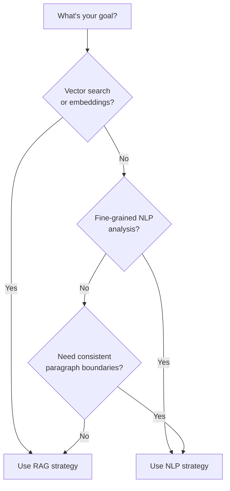

# Choosing a Chunking Strategy

This guide helps you choose between RAG and NLP chunking strategies for your use case.

## Quick Decision Tree



**Quick answer**:

- **RAG strategy** (default): Vector search, semantic retrieval, question answering
- **NLP strategy**: Sentence classification, NER, paragraph-level analysis
- **Need exact token control for embedding models?** → Use `token_aware`
- **Technical documentation with code blocks?** → Use `technical`
- **Need small-to-big retrieval (parent + child chunks)?** → Use `small_to_big`

## Strategy Comparison

### RAG/Semantic Strategy (Default)

Optimized for embedding models and vector search.

**Characteristics**:

- Merges paragraphs under the same heading hierarchy
- Target: 100-500 words per chunk (configurable)
- ~60-80% reduction in chunk count
- Average chunk: 250 words

**Use cases**:

- Vector databases (Pinecone, Weaviate, Qdrant)
- RAG (Retrieval-Augmented Generation) systems
- Semantic search
- Question answering
- Document similarity
- Recommendation engines

**Why it works**:

- Embedding models perform best with 100-500 word contexts
- Preserves semantic coherence by respecting hierarchy
- Reduces redundancy in vector databases
- Better retrieval precision (fewer near-duplicate chunks)

**Example output**:

```json
{
  "text": "First paragraph about liturgy. Second paragraph continuing the same topic. Third paragraph still under same heading.",
  "word_count": 320,
  "hierarchy": {
    "level_1": "Part I: The Liturgy",
    "level_2": "Chapter 1: The Nature of Liturgy"
  },
  "merged_paragraph_ids": [1, 2, 3],
  "source_paragraph_count": 3
}
```

### NLP/Paragraph Strategy

Preserves exact paragraph boundaries for fine-grained analysis.

**Characteristics**:

- One paragraph = one chunk
- No merging across paragraphs
- Average chunk: 40-80 words (varies by document)
- Maximum granularity

**Use cases**:

- Named Entity Recognition (NER)
- Sentence classification
- Paragraph-level sentiment analysis
- Fine-grained topic modeling
- Precise paragraph attribution
- Debugging extraction issues

**Why it works**:

- Preserves exact paragraph structure
- Enables precise attribution
- Better for tasks requiring paragraph context
- Easier to debug (1:1 mapping with source)

**Example output**:

```json
{
  "text": "First paragraph about liturgy.",
  "word_count": 45,
  "hierarchy": {
    "level_1": "Part I: The Liturgy",
    "level_2": "Chapter 1: The Nature of Liturgy"
  },
  "paragraph_id": 1
}
```

## Configuration Examples

### CLI Usage

```bash
# RAG strategy (default)
extract book.epub
extract document.pdf --chunking-strategy rag

# NLP strategy
extract document.html --chunking-strategy nlp
extract book.epub --chunking-strategy paragraph  # alias

# Custom RAG chunk sizes
extract document.pdf --min-chunk-words 200 --max-chunk-words 800
```

### Python API

```python
from extraction.extractors import EpubExtractor, PdfExtractor, HtmlExtractor

# RAG strategy (default)
extractor = EpubExtractor("book.epub")

# Explicit RAG with custom sizes
extractor = PdfExtractor("document.pdf", config={
    'chunking_strategy': 'rag',
    'min_chunk_words': 200,
    'max_chunk_words': 800,
})

# NLP strategy
extractor = HtmlExtractor("page.html", config={
    'chunking_strategy': 'nlp',
})

extractor.load()
extractor.parse()
chunks = extractor.chunks
```

## Performance Comparison

Real-world example: "Prayer Primer.epub" (1,234 paragraphs)

| Strategy | Chunks | Avg Words/Chunk | Use Case |
|----------|--------|-----------------|----------|
| **RAG** (default) | 412 | 250 | Vector search, embeddings |
| **NLP** | 1,234 | 67 | NER, classification |
| **token_aware** | ~450 | 256-512 tokens | Embedding models with token limits |
| **technical** | ~450 | 256-512 tokens | Technical docs with code blocks |
| **small_to_big** | Parent + child | Parent + child | Hierarchical retrieval |

**Storage impact** (with embeddings):

- RAG: 412 vectors × 1536 dims = 632KB
- NLP: 1,234 vectors × 1536 dims = 1.9MB

**Retrieval quality**:

- RAG: Better precision (fewer near-duplicates)
- NLP: Better recall (more granular matches)

## Custom Chunk Sizes

RAG strategy supports custom size ranges.

### Embedding Model Guidelines

Different embedding models have different optimal chunk sizes:

| Model | Context Window | Recommended Range |
|-------|---------------|-------------------|
| **OpenAI text-embedding-3** | 8191 tokens | 100-500 words |
| **embeddinggemma-300m** | 2048 tokens | 100-500 words |
| **BERT-based models** | 512 tokens | 50-200 words |
| **Sentence-transformers** | 256-512 tokens | 100-300 words |

### Configuration

```python
# For BERT-based models (smaller chunks)
extractor = EpubExtractor("book.epub", config={
    'chunking_strategy': 'rag',
    'min_chunk_words': 50,
    'max_chunk_words': 200,
})

# For large context models (bigger chunks)
extractor = PdfExtractor("document.pdf", config={
    'chunking_strategy': 'rag',
    'min_chunk_words': 300,
    'max_chunk_words': 800,
})
```

!!! tip "Token-based re-chunking"
    For production embedding pipelines, use the `token-rechunk` tool after extraction to ensure exact token counts. See [Token Re-chunking Guide](token-rechunking.md).

## Token-Aware Strategies

For precise token control, use the token-aware family of strategies. These use actual tokenizer output (embeddinggemma-300m by default) rather than word counts.

The `small_to_big` strategy creates two levels of chunks. Child chunks (smaller, more focused) are used for vector search, while parent chunks (broader context) are retrieved after a match. This is useful for RAG systems where you want precise matching but rich context.

### CLI Examples

```bash
# Token-aware for embedding optimization
extract document.epub --chunking-strategy token_aware --target-tokens 400

# Small-to-big for hierarchical retrieval
extract document.epub --chunking-strategy small_to_big
```

### Python API

```python
from extraction.extractors import EpubExtractor

extractor = EpubExtractor("book.epub", config={
    'chunking_strategy': 'token_aware',
    'target_tokens': 400,
    'min_tokens': 256,
    'max_tokens': 512,
})
extractor.load()
extractor.parse()
chunks = extractor.chunks
```

## Troubleshooting

### Too Many Chunks

**Symptom**: RAG strategy produces thousands of chunks for a small document.

**Causes**:

1. Many short paragraphs (< min_chunk_words)
2. Deep heading hierarchy (prevents merging)
3. Chunking strategy not applied correctly

**Solutions**:

```python
# Increase min chunk size to force more merging
extractor = EpubExtractor("book.epub", config={
    'chunking_strategy': 'rag',
    'min_chunk_words': 300,  # Higher minimum
    'max_chunk_words': 800,
})

# Check configuration was applied
assert extractor.config['chunking_strategy'] == 'rag'
```

### Too Few Chunks

**Symptom**: RAG strategy produces very few chunks with 1000+ words each.

**Causes**:

1. Flat hierarchy (no headings to break at)
2. max_chunk_words set too high
3. Document has very long paragraphs

**Solutions**:

```python
# Lower max chunk size
extractor = PdfExtractor("document.pdf", config={
    'chunking_strategy': 'rag',
    'min_chunk_words': 100,
    'max_chunk_words': 400,  # Lower maximum
})

# Or use NLP strategy for exact paragraph boundaries
extractor = PdfExtractor("document.pdf", config={
    'chunking_strategy': 'nlp',
})
```

### Chunks Crossing Hierarchy Boundaries

**Symptom**: RAG chunks merge paragraphs from different sections.

**Cause**: RAG chunking respects hierarchy but may merge across same-level headings.

**Solution**: RAG strategy only merges paragraphs under the **same** hierarchy path. This is intentional. If you need stricter boundaries:

```python
# Use NLP strategy for no merging
extractor = EpubExtractor("book.epub", config={
    'chunking_strategy': 'nlp',
})

# Or lower chunk sizes to reduce merging
extractor = EpubExtractor("book.epub", config={
    'chunking_strategy': 'rag',
    'min_chunk_words': 50,
    'max_chunk_words': 150,
})
```

### Quality Score Issues

**Symptom**: Quality score drops when switching strategies.

**Cause**: Quality scoring uses paragraph-level signals. RAG merging may affect scores.

**Solution**: Quality scores are computed **before** chunking strategy is applied, so they should be unaffected. If you see differences:

```python
# Extract with both strategies and compare
from extraction.extractors import EpubExtractor

rag_extractor = EpubExtractor("book.epub", config={'chunking_strategy': 'rag'})
rag_extractor.load()
rag_extractor.parse()

nlp_extractor = EpubExtractor("book.epub", config={'chunking_strategy': 'nlp'})
nlp_extractor.load()
nlp_extractor.parse()

# Metadata should be identical
assert rag_extractor.extract_metadata() == nlp_extractor.extract_metadata()
```

## Batch Processing

Apply chunking strategy to entire directories:

```bash
# RAG strategy for all documents
extract corpus/ -r --output-dir rag_chunks/ --chunking-strategy rag

# NLP strategy for all documents
extract corpus/ -r --output-dir nlp_chunks/ --chunking-strategy nlp

# Custom sizes
extract corpus/ -r --output-dir custom_chunks/ \
    --min-chunk-words 200 --max-chunk-words 600
```

## Next Steps

- For token-based chunking (production embeddings), see [Token Re-chunking Guide](token-rechunking.md)
- For understanding token-aware strategies in depth, see [Chunking Strategies Explanation](../explanation/chunking-strategies.md#token-aware-strategies)
- For vector database integration, see [Vector Database Tutorial](../getting-started/vector-db.md)
- For custom analyzers, see [Custom Analyzers Guide](custom-analyzers.md)
